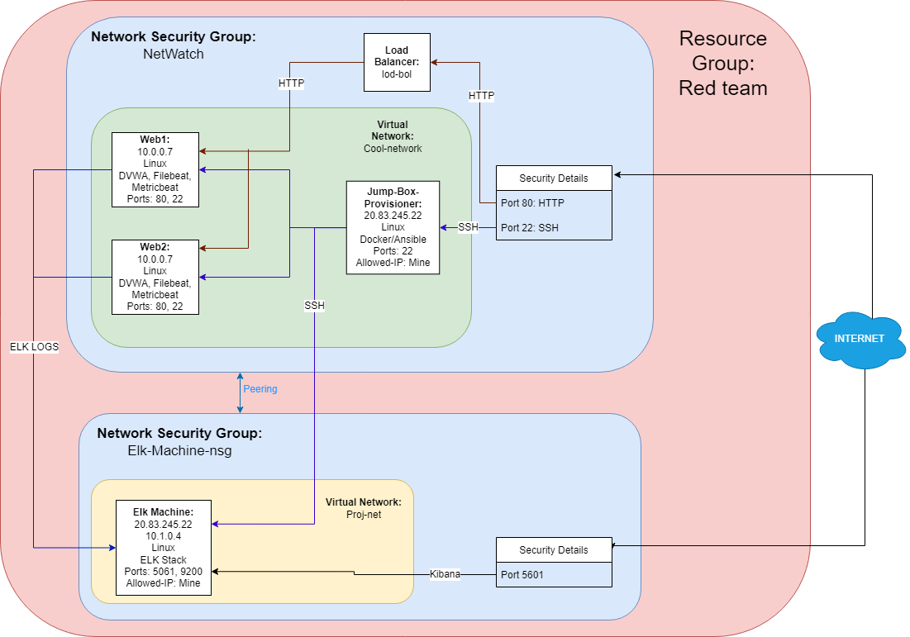

## Automated ELK Stack Deployment

The files in this repository were used to configure the network depicted below.

These files have been tested and used to generate a live ELK deployment on Azure. They can be used to either recreate the entire deployment pictured above. Alternatively, select portions of the playbook file may be used to install only certain pieces of it, such as Filebeat.

  - [install-elk.yml](install-elk.yml)

This document contains the following details:
- Description of the Topologu
- Access Policies
- ELK Configuration
  - Beats in Use
  - Machines Being Monitored
- How to Use the Ansible Build

### Description of the Topology

The main purpose of this network is to expose a load-balanced and monitored instance of DVWA, the D*mn Vulnerable Web Application.

Load balancing ensures that the application will be highly available, in addition to restricting access to the network.
- A loadbalancer allows multiple machines to have a single entry point, thus promoting availability.
- A jumpbox is a system on a network used to access and manage devices in a separate security zone.

Integrating an ELK server allows users to easily monitor the vulnerable VMs for changes to the Log files and system resources.
- Filebeat tracks audit logs, gc logs, server logs, and deprecation logs on your systems.
- Metricbeat is used to get system-level CPU usage, memory, file system, disk IO, and network IO statistics, as well as top-like statistics for every process running on your systems.

The configuration details of each machine may be found below.

| Name       |       Function       | IP Address | Operating System |
|------------|----------------------|------------|------------------|
| Jump Box   | Gateway              | 10.0.0.1   | Linux            |
| Elk-Server | Elastic Search Stack | 10.1.0.4   | Linux            |
| Web1       | Webserver            | 10.0.0.7   | Linux            |
| Web2       | Webserver            | 10.0.0.6   | Linux            |

### Access Policies

The machines on the internal network are not exposed to the public Internet. 

Only the Jumpbox machine can accept connections from the Internet. Access to this machine is only allowed from the following IP addresses:
- 98.206.208.92

Machines within the network can only be accessed by Jumpbox.
- Jumpbox
  - 20.83.245.22
  - 10.0.0.4

A summary of the access policies in place can be found in the table below.

| Name     | Publicly Accessible | Allowed IP Addresses |
|----------|---------------------|----------------------|
| Jump Box | Yes                 | 98.206.208.92        |
|  Ekl     | Yes                 | 98.206.208.92        |
|  Web1    | No                  | 10.0.0.1             |
|  Web2    | No                  | 10.0.0.1             |

### Elk Configuration

Ansible was used to automate configuration of the ELK machine. No configuration was performed manually, which is advantageous because...
- Ansible allows for easy automation to prevent setup errors when setting up multiple machines 

The playbook implements the following tasks:
- Install docker.io
- Install python3-pip
- Install Docker Module
- Increase Memory usage
- Download and Launch Docker ELK Container
- Enable Docker on startup

The following screenshot displays the result of running `docker ps` after successfully configuring the ELK instance.

### Target Machines & Beats
This ELK server is configured to monitor the following machines:
- 10.0.0.6
- 10.0.0.7

We have installed the following Beats on these machines:
- Filebeat
- Metricbeat

These Beats allow us to collect the following information from each machine:
- Filebeat logs system events on the machines being monitored. This helps monitor what is happening on a machine, ie who is doing what.
- Metricbeat logs resource information on the machines being monitored. This is helpful to know what machines need to be upgraded or are being overloaded with tasks.

### Using the Playbook
In order to use the playbook, you will need to have an Ansible control node already configured. Assuming you have such a control node provisioned: 

SSH into the control node and follow the steps below:
- Copy the [install-elk.yml](install-elk.yml) to `/etc/ansible/roles/`.
- Update the Host file to include the ip of the elk server as a target catagory
- Run the playbook, and navigate to http://20.97.216.65:5601/app/kibana to check that the installation worked as expected.

